# 🛡️ IBVAP — Intelligent Border Video Analytics Platform

> **Smart India Hackathon 2026 · Problem Statement: SIH26187**  
> **AI-Based Intelligent Video Analytics Platform for Border Surveillance using existing CCTV Infrastructure**  
> **Organization:** Ministry of Home Affairs · **Department:** Sashastra Seema Bal (SSB), Police II Division  
> **Category:** Software · **Theme:** Smart Automation

[](#smart-india-hackathon-2026)
[](#project-status)
[](#security-hardening)
[](#forensic-traceability--data-integrity)
[](#reliability)
[](#ai-models-and-validation)
[](#performance-and-operational-validation)
[](#project-status)


> **v2.1.0 ENGINEERING UPDATE:** IBVAP now documents the complete evolution from core CCTV analytics through predictive intelligence, PTZ cueing, cross-camera correlation, distributed edge mesh, model governance, continuous AI quality feedback, and multimodal/thermal readiness. Phase XV completed the real-thermal acquisition and native-training architecture, while explicitly reporting **NO REAL LWIR SENSOR / NO REAL LWIR DATASET / NATIVE THERMAL AI NOT VALIDATED** until physical evidence exists.

---

## 📚 Documentation Navigation

- [What Is IBVAP?](#1--what-is-ibvap)
- [Problem Statement Mapping](#3-problem-statement-mapping)
- [High-Level Architecture](#6-high-level-architecture)
- [End-to-End Operational Workflow](#7-end-to-end-operational-workflow)
- [AI Models and Validation](#9-ai-models-and-validation)
- [Predictive Intelligence & PTZ](#28--predictive-intelligence--ptz-flow)
- [Distributed Edge Mesh](#29--distributed-edge-mesh)
- [Model Lifecycle & AI Quality](#30--model-lifecycle--ai-quality-feedback)
- [Unified Evidence Graph](#31--unified-evidence-graph)
- [Phase XV Thermal Intelligence](#26--phase-xv-thermal-intelligence-flow)
- [Production vs Experimental Matrix](#35--production-vs-experimental-capability-matrix)
- [Testing](#52-testing)
- [Project Status](#55-project-status)
- [Judge FAQ](#??)

---

## 1. What Is IBVAP?

**IBVAP (Intelligent Border Video Analytics Platform)** is a software-defined surveillance platform designed to transform conventional CCTV infrastructure into an intelligent, event-driven border monitoring system.

The central idea is simple:

> **Do not replace the existing CCTV network. Make it intelligent through software.**

IBVAP ingests standard IP-camera/video streams and adds AI-powered analytics such as:

- Human detection and tracking
- Vehicle detection and classification
- Virtual-fence / restricted-zone intrusion detection
- Real-time security alerts
- Event logging and operational dashboards
- ANPR with forensic lineage
- Face-processing integration with safety and review gates
- Evidence capture with cryptographic integrity hashing
- Multi-camera situational awareness
- System-health and infrastructure monitoring
- Live/demo/test data isolation
- Production readiness and security guardrails

The platform is designed around the constraints of remote surveillance environments: limited compute, unreliable networks, many simultaneous cameras, strict auditability, and the need to avoid replacing expensive camera hardware.

---

## 2. Why This Idea Was Chosen

Traditional CCTV systems are excellent at **recording video**, but recording alone does not answer the operator's most important questions:

- **Who entered a restricted area?**
- **Where did the person come from?**
- **Which camera saw them?**
- **Was the movement normal or suspicious?**
- **Was a vehicle involved?**
- **Was the event detected early enough to act?**
- **Can the operator prove what happened later?**

The SIH problem statement specifically targets the conversion of existing IP-based CCTV infrastructure into an AI-driven surveillance network without requiring dedicated smart-camera, FRS, or ANPR hardware.

IBVAP therefore focuses on a **software-first augmentation layer** that can sit on top of existing cameras.

### Core design principle

**Existing CCTV → AI perception → tracking → rules/risk → alert → evidence → operator response → audit**

---

## 3. Problem Statement Mapping

| SIH Requirement | IBVAP Response |
|---|---|
| Human detection and tracking | Detector + multi-object tracker |
| Vehicle detection/classification | Vehicle detector/classifier |
| Face detection / face processing | Dedicated face-processing pipeline with quality gates |
| ANPR | Plate detection + OCR + track-linked provenance |
| Virtual fence intrusion detection | Configurable normalized zones + crossing logic |
| Suspicious activity detection | Rule/risk pipeline built on tracked events |
| Night-time movement | Low-light/night-aware analysis path |
| Real-time alerts | Event/risk engine + dashboard alerts |
| Event logging | Persistent security/event records |
| Existing CCTV infrastructure | Standard IP/video stream ingestion |
| Cost-effective scaling | Shared AI workers, frame decoupling, throttling |
| Command-and-control integration | API/event architecture + operator dashboard |
| Forensic traceability | Source-frame lineage + evidence hashing |

> **Important:** Feature availability and production readiness are not the same thing. IBVAP deliberately exposes unavailable/uncalibrated capabilities rather than fabricating operational truth.

---

## 4. The Real-World Problems We Are Solving

### 4.1 Human monitoring does not scale

An operator cannot reliably watch four, eight, or dozens of feeds continuously and detect every subtle intrusion.

### 4.2 Conventional CCTV is reactive

Most CCTV deployments record video and rely on someone noticing an event in real time or investigating it later.

### 4.3 Smart-camera deployments can be expensive

Replacing a large installed camera network with specialized AI cameras can create significant capital and maintenance costs.

### 4.4 Remote locations have constrained computing

Border posts may not have workstation-class GPUs, unlimited memory, or stable high-bandwidth links.

### 4.5 False alerts are operationally expensive

A system that detects everything—including poles, shadows, reflections, and duplicate events—can become unusable because operators stop trusting it.

### 4.6 AI results must be auditable

A security alert should be traceable to:

`camera → frame → detection → track → rule → event → evidence → operator action`

### 4.7 Demo data must never masquerade as operational truth

Simulation is useful for hackathon demonstrations, but simulated events must not contaminate live statistics, history, alerts, or forensic records.

---

## 5. Proposed Solution

IBVAP uses a layered architecture:

```text
┌───────────────────────────────────────────────────────────────────┐
│                        EXISTING CCTV NETWORK                       │
│      IP Cameras / RTSP / Recorded Surveillance Video              │
└───────────────────────────────┬───────────────────────────────────┘
                                │
                                ▼
┌───────────────────────────────────────────────────────────────────┐
│                         VIDEO INGESTION                            │
│  Connection control · frame decoding · reconnect · health checks  │
└───────────────────────────────┬───────────────────────────────────┘
                                │
                  ┌─────────────┴─────────────┐
                  │                           │
                  ▼                           ▼
       ┌───────────────────┐        ┌────────────────────┐
       │ DISPLAY PATH      │        │ AI PATH            │
       │ Latest frame only │        │ Latest AI frame    │
       │ WebRTC/MJPEG      │        │ Queue size = 1     │
       └───────────────────┘        └─────────┬──────────┘
                                             │
                                             ▼
                                ┌─────────────────────────┐
                                │ AI DETECTOR              │
                                │ RF-DETR / benchmarked    │
                                │ model candidates         │
                                └────────────┬────────────┘
                                             │
                                             ▼
                                ┌─────────────────────────┐
                                │ MULTI-OBJECT TRACKER     │
                                │ Camera-qualified IDs     │
                                └────────────┬────────────┘
                                             │
                    ┌────────────────────────┼────────────────────────┐
                    │                        │                        │
                    ▼                        ▼                        ▼
             Zone / Risk Rules            ANPR             Face Processing
                    │                        │                        │
                    └────────────────────────┼────────────────────────┘
                                             │
                                             ▼
                                ┌─────────────────────────┐
                                │ EVENT / ALERT ENGINE    │
                                │ Severity + correlation  │
                                └────────────┬────────────┘
                                             │
                         ┌───────────────────┼───────────────────┐
                         │                   │                   │
                         ▼                   ▼                   ▼
                    PostgreSQL            Evidence          WebSocket/API
                         │                   │                   │
                         └───────────────────┼───────────────────┘
                                             ▼
                                ┌─────────────────────────┐
                                │ IBVAP COMMAND CENTER     │
                                │ Live video · alerts      │
                                │ tracks · ANPR · health   │
                                └─────────────────────────┘
```

---

## 6. High-Level Architecture

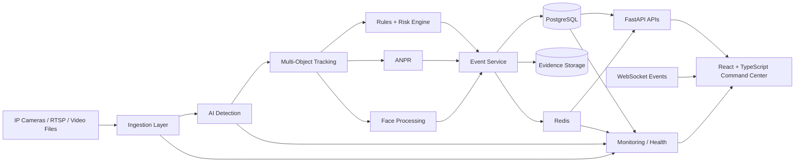

---

## 7. End-to-End Operational Workflow

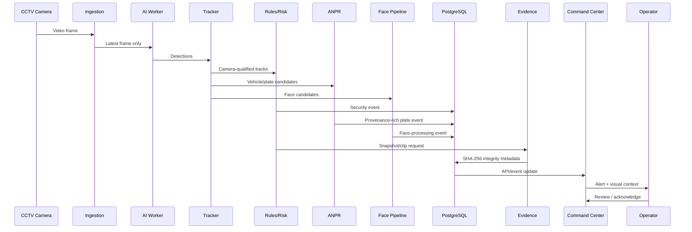

---

## 8. AI Pipeline

### Detection

The detector answers:

> **What objects are visible in this frame?**

The primary classes for the benchmark are intentionally constrained to:

- `0 = person`
- `1 = vehicle`

The model layer is designed to be replaceable so that the detector can evolve without rewriting the rest of the surveillance stack.

### Tracking

The tracker answers:

> **Is this the same object I saw a moment ago?**

A tracker maintains temporal continuity across frames and reduces repeated counting of the same object.

### Rules and risk

Tracking alone does not create a security incident.

IBVAP converts tracks into operational events through rules such as:

- Restricted-zone crossing
- Virtual-fence crossing
- Persistence/dwell conditions
- Directional movement where calibration exists
- Suspicious movement heuristics
- Night-time movement conditions
- Vehicle/person co-occurrence
- Event cooldown/de-duplication

---

## 9. AI Model Strategy

## 9. AI Models and Validation

IBVAP v2.0.0 uses a specialist three-model perception architecture. The
release models are frozen and versioned independently from the shared
tracking, event, risk, evidence, and dashboard layers.

| Domain | Production / Active Model | Primary Classes | Status |
|---|---|---|---|
| Ground | **Ground v2.0** | Person, Vehicle | Production Active |
| Airborne | **Airborne v2** | Drone, Aircraft | Production Active |
| Security Item | **Security Item v2.1** | Firearm | Production Active |
| Thermal | **No production thermal model** | Sensor-dependent | **NOT VALIDATED** |

> Thermal AI is intentionally excluded from production until real LWIR data, physical calibration, frozen benchmark evidence, and hardware validation are available.

### Ground v2.0

Ground v2.0 is the active production ground detector for persons and
vehicles.

### Airborne v2

Airborne v2 detects drones and aircraft and supports image-space air-zone analysis. It is retained as the active airborne production model.

### Security Item v2.1

Security Item v2.1 detects firearms and uses a mandatory multi-frame
temporal confirmation policy before escalation.

### Validation principle

Model quality is evaluated with Precision, Recall, F1, mAP, latency, and
operational metrics on frozen benchmark datasets. A model prediction is
not treated as confirmed intelligence without the applicable temporal,
rule-based, or operator-review controls.

**Important:** The Security Item model passed its software benchmark gates,
but real-firearm border surveillance video was not available for full
field-domain validation. This limitation remains part of the release
documentation.

## 10. Why a Detector + Tracker Architecture?

A detector tells us **what is present now**.

A tracker gives us **continuity over time**.

For surveillance, continuity matters because the operator needs to see:

```text
CAM-001
   ↓
person detected
   ↓
track created
   ↓
track persists
   ↓
track enters restricted zone
   ↓
alert generated
   ↓
evidence attached
```

Without tracking, the system can repeatedly treat one person as many different detections.

---

## 11. Identity Model

### IBVAP uses camera-qualified track identity

The platform does **not** equate object-tracking identity with human biometric identity.

A surveillance object receives a camera-qualified identifier such as:

```text
CAM-001:P-024
CAM-002:V-007
```

This means:

- `CAM-001` → physical camera/sensor context
- `P-024` → local person track identifier
- `V-007` → local vehicle track identifier

### Why this identity model?

Because a border-surveillance tracker needs a stable **operational reference**, not an unsupported claim that the object is the same real-world person across unrelated cameras.

### Comparison

| Identity approach | Advantage | Disadvantage | IBVAP position |
|---|---|---|---|
| Frame-local detection ID | Very simple | No temporal continuity | Insufficient |
| Global sequential ID | Easy to display | Can collide / lacks camera context | Weak |
| Camera-local tracker ID | Efficient | Only meaningful within camera | Good |
| **Camera-qualified track ID** | Traceable, collision-resistant, audit-friendly | Does not prove cross-camera identity | **Chosen** |
| Face biometric identity | Can identify a person | Privacy, accuracy, pose, lighting, enrollment, legal/governance complexity | Separate gated subsystem |
| Cross-camera re-identification | Potential global continuity | Domain shift, identity errors, costly compute, privacy risk | Future/controlled research |

### Key principle

> **Tracking identity is not the same thing as human identity.**

This separation is especially important for a trustworthy surveillance platform.

---

## 12. Forensic Traceability & Data Integrity

A major differentiator of IBVAP is that the platform does not treat AI output as an isolated prediction.

### ANPR provenance

A plate result can retain:

- Camera ID
- Track ID
- Source frame ID
- Timestamp
- Vehicle bounding box
- Plate bounding box
- OCR confidence
- Raw OCR candidates
- Crop/evidence reference
- Watchlist result

### Face-processing provenance

Face events can retain:

- Source frame ID
- Face bounding box
- Detection/quality score
- Camera/track context
- Review state

### Evidence integrity

Evidence files are associated with:

- SHA-256 hash
- Capture timestamp
- Camera ID
- Event ID
- Data origin

This allows later verification that an evidence artifact was not silently modified.

---

## 13. LIVE / DEMO / TEST Data Isolation

IBVAP explicitly separates data origins.

```text
LIVE
DEMO
TEST
IMPORTED
```

### Why?

A hackathon demonstration often needs synthetic or seeded events. Those records must not alter:

- live alert totals
- live history
- operational risk statistics
- ANPR history
- forensic records presented as real

### Design rule

> **Demo mode must never create fake operational truth.**

---

## 14. Ground-Truth Benchmarking

AI accuracy is not declared from visual impressions.

IBVAP uses a formal ground-truth workflow:


### Benchmark rules

1. Ground truth is human-reviewed.
2. AI predictions remain separate from labels.
3. Prelabels may assist human review but do not become ground truth automatically.
4. The benchmark is frozen before comparing models.
5. Model comparisons use the same evaluation protocol.
6. No metric is fabricated when annotations are missing.

### Prior benchmark snapshot

A previously frozen evaluation cycle reported:

- 196 annotated frames
- 1,098 person boxes
- 102 vehicle boxes
- Person recall: 11.9%
- Vehicle recall: 72.5%
- 23 person false positives

These values are useful as a **historical baseline snapshot**. They should be regenerated whenever the benchmark data is recreated or materially changed.

---

## 15. AI Evaluation Metrics

The benchmark should report, at minimum:

### Per class

- Precision
- Recall
- F1
- mAP@0.50
- mAP@0.50:0.95

### Operational metrics

- False alerts per hour
- Missed zone crossings
- Track ID switches
- Detection latency
- P50/P95 inference latency
- AI FPS
- Frame age
- Dropped AI frames

### Why this matters

A model can have strong mAP and still be unsuitable for operations if:

- it is too slow,
- it causes too many false alarms,
- it drops important small objects,
- it loses tracks under occlusion,
- or it cannot sustain multiple cameras.

---

## 16. Performance Engineering

IBVAP treats video display and AI inference as separate workloads.

### Decoupled frame pipeline

```text
Camera
  │
  ├──► Latest display frame ─────► UI
  │
  └──► Latest AI frame (queue=1)
            │
            ▼
       AI inference
            │
            ▼
         Tracking
            │
            ▼
      Rules / events
```

### Core optimizations

- `AI_INFERENCE_INTERVAL` controls AI density independently of display.
- Only the latest pending AI frame is kept.
- Old AI work is dropped instead of building a latency backlog.
- OpenCV threading is constrained to avoid CPU oversubscription.
- PyTorch threading is bounded.
- One shared model service per process/GPU is preferred over loading a model per camera.
- JPEG/evidence operations should stay off the capture thread.
- Tracker buffers are tuned for occlusion-heavy scenes.
- AI FPS and display FPS are measured separately.

### Why the dashboard can show low AI FPS

The current architecture can run video ingestion above the AI processing rate by design.

For example:

```text
Camera stream: 15 FPS
AI inference: 4 FPS
AI interval: every 5th frame
```

This can still be correct for a resource-constrained deployment, provided:

- the displayed video remains responsive,
- frame age is bounded,
- events are not delayed beyond operational limits,
- dropped-frame behavior is measured,
- and the detector accuracy remains adequate.

---

## 17. Tracking Optimization

Tracking quality affects both accuracy and operator trust.

### Key goals

- Reduce ID switches
- Preserve tracks during short occlusions
- Avoid creating excessive new tracks
- Prevent duplicate alerts
- Maintain camera-qualified identity
- Handle people and vehicles separately where appropriate

### Tracker configuration strategy

IBVAP maintains tracker configuration outside application code so that tuning can be benchmarked and versioned.

Example configuration direction:

```text
Higher track buffer
        ↓
Better short-term occlusion survival
        ↓
Fewer identity switches
        ↓
Potentially more stale-track risk
```

Therefore tracker tuning must be validated against real benchmark sequences rather than chosen by intuition alone.

---

## 18. Virtual Fence / Restricted Zone Logic

Zone definitions are stored in normalized coordinates rather than raw pixels.

```text
Image width  = W
Image height = H

normalized point:
(x / W, y / H)
```

This makes zones portable across resolutions.

### Zone validation should reject

- self-intersecting polygons
- duplicate points
- zero-area polygons
- malformed polygons
- source-resolution mismatch
- degenerate fences

### Operational safeguards

- entry/exit debounce
- cooldowns
- hysteresis
- per-track event state
- configurable severity
- evidence capture
- operator acknowledgment

---

## 19. Dashboard / Command Center

IBVAP provides a command-center interface designed for fast situational awareness rather than generic analytics.

### Core views

- Camera directory
- Live multi-camera grid
- Focused camera view
- Tactical/map view where geospatial data is actually available
- Active alerts
- Tracks
- ANPR
- System health
- Event history
- Evidence context
- Live/demo visibility indicators

### Dashboard design philosophy

The operator should answer these questions in seconds:

1. **What is happening?**
2. **Where is it happening?**
3. **How serious is it?**
4. **Which camera saw it?**
5. **What evidence exists?**
6. **Is the AI/current system healthy?**

### Truthful UI principle

If geographic information is not available, IBVAP explicitly shows:

> **Geospatial view unavailable**

It does not invent coordinates.

---

## 20. Security Architecture

Security is a first-class part of IBVAP because the platform processes surveillance data.

### Implemented / validated hardening

- Fail-fast production secret configuration
- Shorter access-token lifespan
- Secure cookie configuration for HTTPS deployment
- Authenticated WebSocket handshake
- PostgreSQL/Redis host-port isolation in deployment
- Security scanning in CI
- Production guard against PostgreSQL being replaced by SQLite
- Readiness audit script

### Security flow

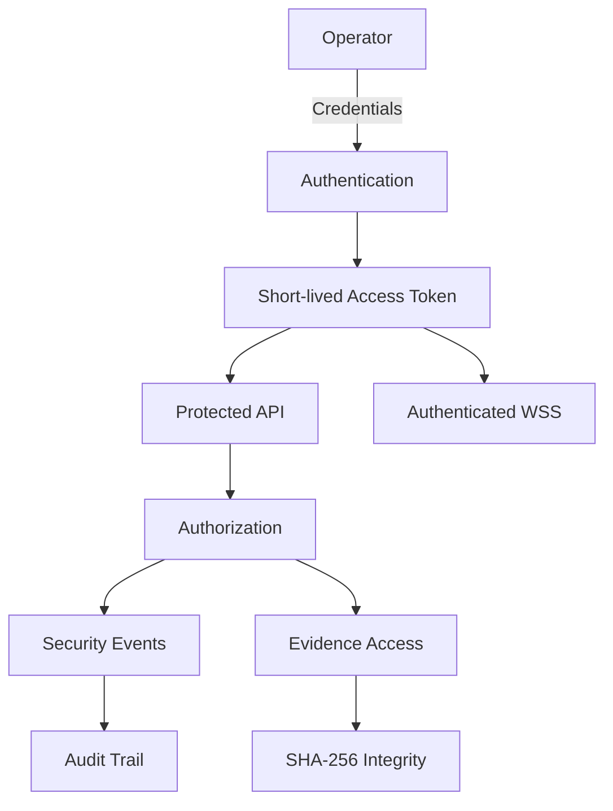

---

## 21. Production Guard Rails

Production is not allowed to silently degrade into an unsafe configuration.

### Example rule

```text
Environment = production
            +
DATABASE_URL = sqlite
            ↓
        FAIL CLOSED
```

The application explicitly rejects this configuration rather than pretending that SQLite is an acceptable shared production database.

### Production readiness checks

The readiness audit covers:

- target data/evidence directories
- filesystem writability
- PostgreSQL connectivity
- Redis connectivity
- insecure/default secret detection
- deployment configuration sanity

---

## 22. Reliability Engineering

IBVAP is designed around failure as a normal operational condition.

### Camera failures

- timeout detection
- frozen-frame detection
- reconnect logic
- exponential backoff
- jitter
- per-camera isolation

### Backend failures

- service health endpoints
- database checks
- Redis checks
- worker lifecycle management
- graceful shutdown

### Observability targets

The operator should be able to see:

- camera count
- display FPS
- AI FPS
- frame age
- P50/P95 latency
- CPU
- RAM
- GPU
- VRAM
- queue state
- database state
- ANPR queue state

---

## 23. Difficulties and How IBVAP Handles Them

| Difficulty | Why it is hard | IBVAP response |
|---|---|---|
| Small/distant persons | Few pixels available | Higher-quality detector experiments + benchmark by object size |
| Occlusion | Objects disappear temporarily | Tracker buffering and lifecycle state |
| Shadows/poles/reflections | Cause false positives | Ground-truth evaluation + hard-negative analysis |
| Night conditions | Low SNR and contrast | Night-specific benchmark and preprocessing path |
| Multi-camera compute | AI can saturate CPU/GPU | Shared model workers + frame decoupling |
| AI backlog | Creates stale alerts | Queue size 1 / latest-frame policy |
| Unreliable camera | Stream may freeze/disconnect | Health checks + reconnect |
| Demo data contamination | Fake events can look real | Explicit data-origin field |
| Forensic integrity | Evidence can be altered | SHA-256 evidence hashes |
| SQLite/PostgreSQL differences | DB extensions differ | PostgreSQL for shared/pilot deployments; SQLite for isolated tests |
| Geospatial uncertainty | Coordinates may be missing | Explicit unavailable state instead of fabrication |
| Face recognition risk | Accuracy/privacy concerns | Quality gates + human review + explicit availability |
| AI benchmark leakage | Model can validate itself | Independent human-reviewed GT |

---


## 38. 🧠 IBVAP Intelligence Architecture — From Pixels to Decisions

IBVAP is designed as a **progressive intelligence stack**. Each layer adds context without pretending that an uncertain AI prediction is absolute truth.

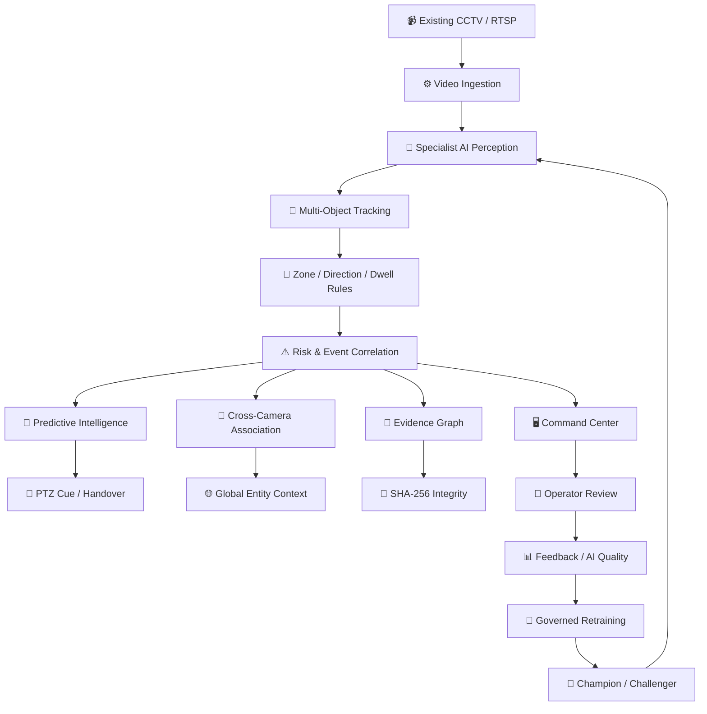

### The intelligence progression

| Layer | Question answered |
|---|---|
| Detection | **What is visible?** |
| Tracking | **Is it the same track over time?** |
| Rules | **Did something operationally significant happen?** |
| Risk | **How serious is the event?** |
| Correlation | **Are multiple observations related?** |
| Prediction | **What may happen next?** |
| PTZ cueing | **Where should the camera look next?** |
| Evidence graph | **Can we reconstruct what happened?** |
| AI quality | **Where is the model failing?** |
| Governance | **Should a new model be trusted?** |

---

## 39. 🚀 Phase Evolution — IBVAP Intelligence Roadmap

IBVAP has evolved as a layered engineering program rather than a single monolithic AI model.


### Post-release intelligence phases

| Phase | Capability | Current posture |
|---|---|---|
| X | Predictive PTZ handover mesh | Promoted architecture |
| XI | Distributed edge mesh + central fallback | Promoted architecture |
| XII | Edge model lifecycle + governance | Promoted architecture |
| XIII | Continuous AI quality + active learning | Promoted governance architecture |
| XIV | Multimodal / cross-spectral thermal architecture | Implemented; thermal AI not validated |
| XV | Real thermal acquisition + native thermal training path | **Ready; blocked by physical sensor/data availability** |
| XVI | Physical LWIR integration + real thermal validation | Next logical step |

> **Important:** "Implemented" means the software architecture and tests exist. It does not automatically mean a capability has been validated in the physical field.

---

## 40. 🔥 Phase XV Thermal Intelligence Flow

Phase XV is deliberately designed to fail closed when genuine thermal evidence is unavailable.

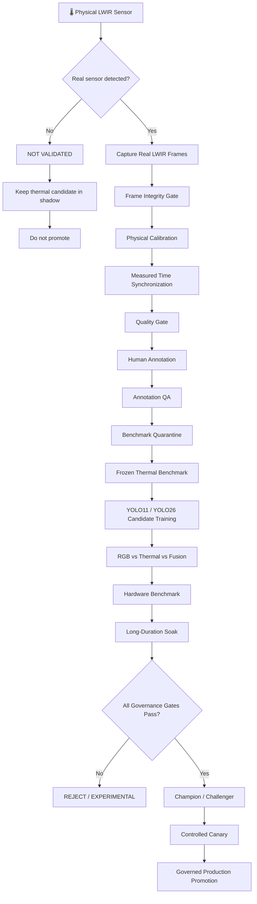

### Phase XV truth state

```text
REAL_THERMAL_SENSOR       = NO
REAL_THERMAL_DATASET      = NO
CALIBRATION               = NOT_VALIDATED
NATIVE THERMAL YOLO11     = NOT_VALIDATED
NATIVE THERMAL YOLO26     = NOT_VALIDATED
THERMAL BENCHMARK         = READINESS-v0 / FROZEN
RGB + THERMAL FUSION      = EXPERIMENTAL
HARDWARE SOAK             = NOT RUN
FINAL THERMAL STATUS      = NOT_VALIDATED
```

This is intentional. The system never converts simulated thermal processing into a false field-validation claim.

---

## 41. 🌐 Cross-Camera Intelligence & Global Evidence Flow

IBVAP separates **local camera identity** from **probabilistic cross-camera association**.

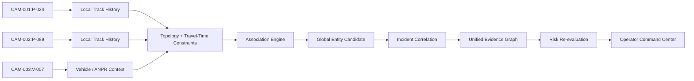

### Identity rule

> **A global entity is a probabilistic association, not proof of human identity.**

Immutable camera-qualified IDs remain available for forensic traceability even when a global association is created.

---

## 42. 🔭 Predictive Intelligence + PTZ Flow

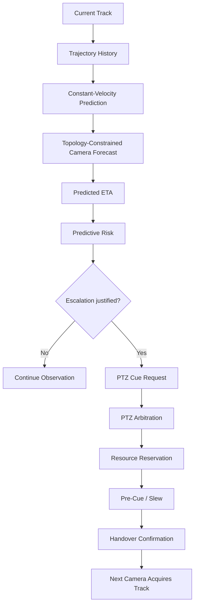

PTZ movement is governed by authorization, arbitration, prediction confidence, resource reservation, and operator override controls.

---

## 43. 🕸️ Distributed Edge Mesh

For constrained border environments, IBVAP can distribute camera intelligence toward edge nodes while retaining a central control plane.

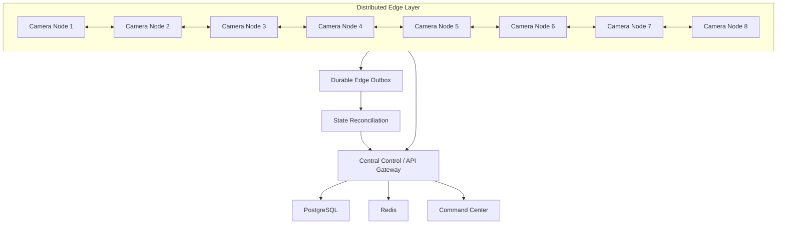

### Edge resilience principles

- Short-lived cryptographic authorization leases
- HMAC-SHA256 peer messages
- Monotonic sequence/replay protection
- Persistent outbox
- Topology validation
- Central fallback
- Partition detection
- Chronological reconciliation
- Global PTZ arbitration
- Operator emergency lock

---

## 44. 🔄 Model Lifecycle & AI Quality Feedback

IBVAP does not treat model training as a one-time event.

```mermaid
flowchart LR
    A["Live / Validated Data"] --> B["Detection"]
    B --> C["Operator Feedback"]
    C --> D["Failure Discovery"]
    D --> E["Hard-Case Mining"]
    E --> F["Active Learning Queue"]
    F --> G["Human Annotation / QA"]
    G --> H["Dataset Version"]
    H --> I["Candidate Training"]
    I --> J["Frozen Benchmark"]
    J --> K["Validation Gates"]
    K --> L["Champion / Challenger"]
    L --> M["Shadow"]
    M --> N["Canary"]
    N --> O["Governed Deployment"]
    O --> P["Monitoring / Drift"]
    P --> D
```

### Governance rule

**No automatic retraining. No automatic production promotion.**

Sensitive model lifecycle actions require explicit governance and auditability.

---

## 45. 🧾 Unified Evidence Graph

Every meaningful event should be reconstructable.

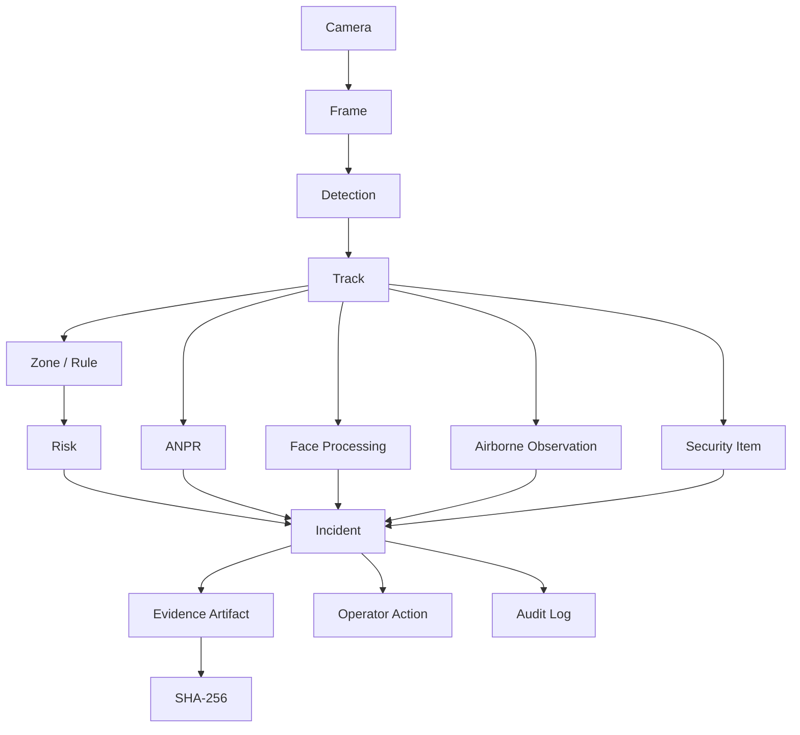

This creates an auditable chain:

```text
camera
  ↓
source frame
  ↓
AI observation
  ↓
track
  ↓
rule / correlation
  ↓
incident
  ↓
evidence
  ↓
operator action
  ↓
audit trail
```

---

## 46. 🧪 Validation Pyramid

Not every passing test means the same thing.

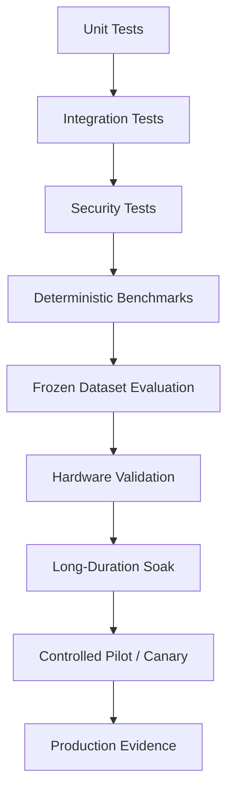

### Evidence hierarchy

| Evidence | What it proves |
|---|---|
| Unit test | A code path behaves as expected |
| Integration test | Services interact correctly |
| Deterministic benchmark | Controlled software behavior |
| Frozen dataset benchmark | Model comparison under fixed data |
| Hardware benchmark | Measured deployment performance |
| Long-duration soak | Runtime stability over time |
| Pilot/canary | Controlled operational behavior |
| Field validation | Real deployment evidence |

> A deterministic software benchmark must never be presented as field validation.

---

## 47. 🎬 SIH Judge Demo — One Complete Story

The strongest demonstration is a single end-to-end operational narrative.

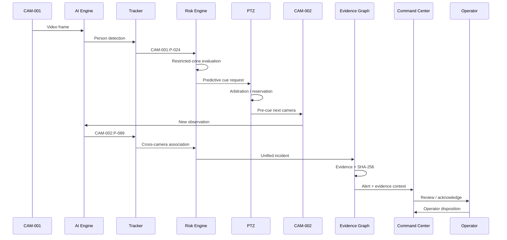

### What the judge should understand

**Detect → Track → Predict → Cue → Correlate → Explain → Preserve Evidence → Human Decision**

That is the story of IBVAP.

---

## 48. 🏆 What Makes IBVAP Different

The differentiator is not simply "AI + CCTV."

### IBVAP combines:

1. **Software-defined surveillance** — intelligence layered onto existing CCTV.
2. **Specialist AI models** — separate ground, airborne, and security-item perception.
3. **Predictive intelligence** — trajectory and camera-transition forecasting.
4. **PTZ orchestration** — governed pre-cue and handover.
5. **Cross-camera correlation** — topology-aware probabilistic association.
6. **Distributed edge mesh** — resilient operation with central fallback.
7. **AI lifecycle governance** — candidate → benchmark → shadow → canary → promotion.
8. **Continuous quality intelligence** — hard-case mining and active learning.
9. **Multimodal architecture** — optical/thermal ready without pretending thermal AI is validated.
10. **Forensic evidence graph** — source-to-incident lineage with SHA-256 integrity.
11. **Truthful operations** — unavailable capabilities are explicitly marked unavailable.
12. **Human decision authority** — AI assists; authorized personnel remain responsible for operational response.

---

## 49. 📊 Production vs Experimental Capability Matrix

| Capability | Status | Evidence posture |
|---|---|---|
| Ground detection | Production | Frozen production model |
| Airborne detection | Production | Frozen production model |
| Security-item detection | Production | Frozen production model |
| Multi-object tracking | Production | Regression tested |
| Virtual fences | Production | Rule-based |
| ANPR lineage | Production | Provenance + evidence |
| Face processing | Gated | Quality/review controlled |
| PTZ cueing | Promoted architecture | Governed control |
| Predictive trajectory | Promoted architecture | Deterministic benchmark |
| Cross-camera association | Promoted architecture | Probabilistic |
| Incident correlation | Promoted | Unified incident logic |
| Evidence graph | Promoted | SHA-256 lineage |
| Distributed edge mesh | Promoted architecture | Software validation |
| Model lifecycle | Promoted governance | Candidate isolation |
| Active learning | Promoted governance | Human approval |
| Native thermal AI | **NOT VALIDATED** | No real LWIR dataset |
| RGB + thermal fusion | Experimental | Algorithmic only |
| Native thermal hardware performance | **NOT VALIDATED** | No physical sensor |
| Georeferenced 3D airspace | Future | Requires calibrated telemetry |

---

## 50. 🗺️ Deployment Architecture

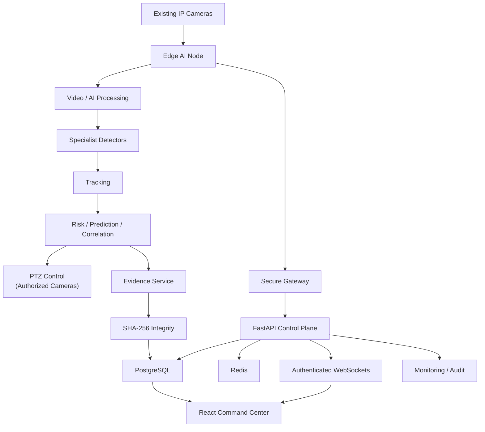

### Deployment principle

**Compute should move closer to the camera when network conditions require it; authority, governance, and auditability should remain centrally controllable.**

---

## 51. 📌 Quick Technical Summary

```text
INPUT
  └── Existing IP cameras / RTSP / recorded video

PERCEPTION
  ├── Ground: person + vehicle
  ├── Airborne: drone + aircraft
  ├── Security Item: firearm
  └── Thermal: architecture ready, AI NOT VALIDATED

INTELLIGENCE
  ├── Multi-object tracking
  ├── Virtual fences
  ├── Risk scoring
  ├── Incident correlation
  ├── Cross-camera association
  ├── Trajectory prediction
  └── PTZ handover

EDGE
  ├── Distributed camera nodes
  ├── Peer handover
  ├── Durable outbox
  ├── Reconciliation
  └── Central fallback

GOVERNANCE
  ├── Frozen benchmarks
  ├── Dataset quarantine
  ├── Model lifecycle
  ├── Champion / Challenger
  ├── Active learning
  ├── Drift monitoring
  └── Controlled promotion

EVIDENCE
  ├── Source frame lineage
  ├── Track lineage
  ├── Incident graph
  ├── Evidence SHA-256
  └── Operator audit

UI
  ├── Live camera grid
  ├── Alerts
  ├── Tracks
  ├── PTZ
  ├── Predictive intelligence
  ├── Edge mesh
  ├── Model lifecycle
  ├── AI quality
  └── Multimodal / thermal status
```

---

## 38. What Makes IBVAP Unique?

IBVAP is not differentiated simply by "using AI."

The stronger differentiation is the **combination of operational correctness + AI + forensic traceability**.

### 1. Software-defined surveillance

Adds intelligence to existing CCTV instead of assuming that every camera must be replaced.

### 2. Truthful operations

Unavailable geospatial or biometric information is shown as unavailable rather than synthesized.

### 3. Forensic lineage by design

An alert can be traced back to its source frame and evidence.

### 4. Camera-qualified tracking identity

Tracking IDs are explicitly scoped to a sensor context.

### 5. AI evaluation discipline

Models are compared against a frozen human-reviewed benchmark instead of subjective screenshots.

### 6. LIVE/DEMO isolation

Hackathon simulation does not contaminate live operational metrics.

### 7. Resource-aware video AI

AI inference is decoupled from stream display so that AI load does not unnecessarily stall the operator feed.

### 8. Production guardrails

Unsafe configurations are rejected instead of merely documented.

---

## 39. Technology Stack

> This table intentionally separates technologies used in the platform from future/experimental technologies.

| Layer | Technology / Approach |
|---|---|
| Frontend | React + TypeScript |
| Styling/UI | Tailwind CSS / reusable dashboard components |
| Backend API | FastAPI |
| Database | PostgreSQL |
| Cache / messaging | Redis |
| AI runtime | PyTorch |
| Primary detector family | YOLO11 |
| Candidate detector family | YOLO26 / governed challengers |
| Tracking | Multi-object tracking with configurable tracker |
| Computer vision | OpenCV |
| ANPR | Plate detection + OCR pipeline |
| Face processing | Dedicated face pipeline with quality gates |
| Evidence integrity | SHA-256 |
| Migrations | Alembic |
| Containers | Docker / Docker Compose |
| Testing | Pytest |
| Frontend validation | npm build |
| CI/CD | GitHub Actions |
| Security scanning | Bandit + npm audit and related CI gates |
| Streaming direction | WebRTC / MediaMTX preferred; MJPEG compatibility path |
| Benchmark format | YOLO annotation format |

---

## 40. Suggested Repository Structure

```text
IBVAP/
├── backend/
│   ├── app/
│   │   ├── api/
│   │   ├── models/
│   │   ├── schemas/
│   │   ├── services/
│   │   ├── workers/
│   │   └── main.py
│   └── tests/
│
├── frontend/
│   └── src/
│       ├── components/
│       ├── pages/
│       ├── stores/
│       ├── hooks/
│       └── ...
│
├── configs/
│   └── bytetrack.yaml
│
├── scripts/
│   ├── extract_benchmark_frames.py
│   ├── format_benchmark_structure.py
│   ├── generate_prelabels.py
│   ├── validate_ground_truth_annotations.py
│   ├── evaluate_baseline.py
│   └── check_production_readiness.py
│
├── benchmark/
│   ├── images/
│   ├── labels/
│   ├── annotations/
│   │   └── prelabels/
│   ├── data.yaml
│   └── results/
│
├── docs/
│   ├── benchmark/
│   ├── validation/
│   └── ...
│
├── data/
│   ├── videos/
│   └── evidence/
│
├── docker-compose.yml
├── .env.example
├── requirements.txt
├── package.json
└── README.md
```

> Adjust this tree to the exact repository layout before publishing a final version. README structure must never claim files that do not exist.

---

## 41. Development Workflow

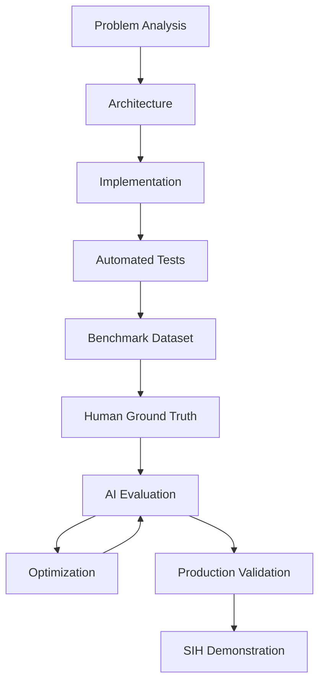

---

## 42. Validation Strategy

## 42. Validation and Release Status

IBVAP completed the controlled engineering and release-validation path:

| Phase | Purpose | Final Result |
|---|---|---|
| P0 | Truthful demo, buildability, data-origin separation | PASS |
| P1 | Security hardening | PASS |
| P2 | Data and evidence integrity | PASS |
| P3 | AI pipeline and performance validation | PASS |
| P4 | Production hardening and deployment controls | PASS |
| P5 | Final release audit | PASS |
| P6 | 24-hour staging soak and release gate G-16 | PASS |

### Final release state

- **Version:** `v2.0.0`
- **Release:** **RELEASE_APPROVED**
- **P6 soak:** 24.0 hours
- **Release gates:** **16 / 16 PASS**
- **Critical defects:** 0
- **High defects:** 0
- **Medium defects:** 0
- **Low defects:** 0
- **SIH readiness:** **READY**

The P6 soak is evidence of operational stability for the validated staging
environment. It does not, by itself, establish universal model accuracy
or field performance under every border condition.

## 43. Known Limitations

## 43. Known Limitations

IBVAP deliberately documents limitations instead of hiding them.

1. **Security-item field-domain gap:** Security Item v2.1 has not been
   validated on real firearm border-surveillance video; its benchmark
   evidence is software/dataset based.
2. **Image-space airborne zones:** Air zones are 2D image-plane regions,
   not calibrated 3D radar airspace.
3. **Camera-local tracking:** Camera-qualified track IDs do not prove
   cross-camera identity.
4. **Environmental variation:** Dust, severe weather, very low light, and
   sensor-specific conditions can affect perception quality.
5. **Human decision authority:** IBVAP is a decision-support system.
   Physical response remains with authorized human personnel.
6. **Deployment specificity:** Performance depends on camera topology,
   resolution, scene complexity, hardware, network conditions, and
   configured AI processing density.

## 44. Security, Privacy and Ethical Principles

IBVAP should never turn a technically possible feature into an unjustified claim.

### Principles

- Minimize retained biometric data.
- Do not silently enroll unknown faces.
- Require appropriate human review for sensitive actions.
- Separate detection from identity claims.
- Keep audit trails for sensitive evidence access.
- Use configurable retention/deletion policies.
- Encrypt sensitive evidence at rest for pilot/production.
- Do not present simulated records as live truth.
- Do not fabricate coordinates or identities.

---

## 45. Future Scope

## 45. Post-Release Research Roadmap

Future work is intentionally separated from the v2.0.0 release.

### Near term
- Expand real border-like validation datasets.
- Complete broader difficult-condition evaluation.
- Continue detector comparison under identical frozen-benchmark protocols.
- Expand security-item classes beyond firearms.
- Improve small-object and occlusion performance.

### Medium term
- Calibrated camera geometry for more precise spatial reasoning.
- Controlled cross-camera re-identification.
- Improved night/thermal fusion.
- Edge inference optimization using supported hardware accelerators.
- Expanded predictive camera and network health analytics.

### Long term
- Multi-sensor radar/RF/thermal fusion.
- Multi-site command-and-control federation.
- Privacy-preserving biometric search where authorized.
- Advanced geospatial intelligence and calibrated 3D airspace reasoning.

## 46. Why Not Just Use a Larger Model?

A larger model is not automatically a better surveillance system.

Increasing model size may improve detection quality but can also increase:

- inference latency
- memory usage
- GPU requirements
- thermal/power requirements
- deployment cost
- queue pressure

IBVAP therefore optimizes for:

```text
Accuracy
   ×
Latency
   ×
Reliability
   ×
Resource efficiency
   ×
Operational usefulness
```

The best model is the one that delivers the required operational outcome under the declared deployment constraints.

---

## 47. Why Not Use AI-Generated Ground Truth?

Because that creates a circular benchmark.

```text
Model A creates labels
       ↓
Model B is evaluated against those labels
       ↓
Metrics can reflect shared model bias
```

IBVAP instead uses:

```text
Human-reviewed ground truth
       ↓
Frozen benchmark
       ↓
Independent model predictions
       ↓
Objective evaluation
```

AI-generated prelabels are acceptable as **annotation assistance**, but only after human verification and approval.

---

## 48. Demo Scenario

A strong SIH demonstration should show one complete operational story rather than a collection of disconnected screens.

### Suggested demo narrative

```text
1. Standard CCTV feed is opened
        ↓
2. Person/vehicle detected
        ↓
3. Track established
        ↓
4. Subject approaches restricted zone
        ↓
5. Virtual-fence crossing is detected
        ↓
6. Risk/alert event generated
        ↓
7. Evidence snapshot/clip captured
        ↓
8. SHA-256 integrity metadata recorded
        ↓
9. Alert appears in Command Center
        ↓
10. Operator reviews and acknowledges
```

This tells the judge **what happened, why it matters, how AI contributed, and how the system proves the event afterward.**

---

## 49. What an AI Judge May Ask — and the Answers

### Q1. What problem are you solving?

We convert conventional CCTV into software-defined intelligent surveillance so operators do not have to manually monitor every feed continuously.

### Q2. Why existing CCTV?

Because installed camera infrastructure is valuable and replacing every camera with specialized smart hardware is costly and operationally difficult.

### Q3. What makes IBVAP different?

The combination of multi-camera AI perception, camera-qualified tracking identity, truthful operational UI, forensic evidence lineage, cryptographic integrity, live/demo isolation, and resource-aware inference.

### Q4. Why RF-DETR?

It is being evaluated as a higher-quality detector candidate against the immutable baseline. It must prove improvement on the same ground-truth benchmark before being promoted.

### Q5. Why not YOLO?

YOLOv11n is an established baseline in IBVAP. It remains the reference model until another detector demonstrates measurable improvement under the same conditions.

### Q6. How do you measure accuracy?

Using human-reviewed ground truth and reporting Precision, Recall, F1, mAP@0.50, mAP@0.50:0.95, false alerts, missed events, and tracking metrics.

### Q7. How do you prevent stale AI frames?

The AI queue is deliberately bounded; old pending frames are dropped so latency does not grow indefinitely.

### Q8. How do you handle many cameras?

Inference is decoupled from display, model services are shared per worker/GPU process, processing density is configurable, and resource usage is continuously monitored.

### Q9. Can you prove an alert really came from a camera?

Yes. Event records can maintain source frame/camera/track context, while evidence is stored with SHA-256 integrity metadata.

### Q10. Are simulated alerts mixed with live alerts?

No. Data origin is explicitly tracked so DEMO and LIVE records remain separated.

### Q11. Can the map show any camera anywhere?

No. If geospatial metadata/calibration is unavailable, the UI explicitly says geospatial view is unavailable instead of inventing coordinates.

### Q12. Can tracking identity identify a real human?

No. A camera-qualified tracker identity means temporal object continuity within a sensor context. Biometric identity is a separate gated subsystem.

### Q13. What happens if the camera disconnects?

The platform should detect the failure, expose the degraded state, attempt controlled reconnects, and avoid presenting stale frames as current truth.

### Q14. Why is production only conditional?

Because production readiness must include physical soak testing, backup/restore drills, actual HTTPS/WSS validation, model-integrity verification, and deployment-hardware evidence.

---

## 50. Testing

### Backend

```bash
pytest -q
```

### Frontend

```bash
npm run build
```

### Ground-truth validation

```bash
python scripts/validate_ground_truth_annotations.py
```

### Baseline evaluation

```bash
python scripts/evaluate_baseline.py
```

### Production readiness

```bash
python scripts/check_production_readiness.py
```

> Run commands from the repository root or the exact paths defined by the current project layout.

---

## 51. Benchmark Lifecycle

```text
RAW VIDEOS
   ↓
Representative frame extraction
   ↓
Dataset structure normalization
   ↓
Human annotation
   ↓
Annotation validation
   ↓
Ground-truth freeze
   ↓
Baseline detector
   ↓
RF-DETR candidate
   ↓
Fine-tuning
   ↓
Objective comparison
   ↓
Champion model selection
   ↓
Deployment validation
```

### Golden rule

> **Never change the benchmark to make a model look better.**

---

## 52. Reproducibility

Every serious benchmark should record:

- Git commit
- Model weights checksum
- Model architecture/version
- Runtime versions
- Device
- Image size
- Confidence threshold
- IoU threshold
- Dataset version
- Ground-truth version
- Tracker configuration
- AI frame interval
- Timestamp
- Hardware details

This makes model comparisons reproducible and defensible.

---

## 53. Model Promotion Policy

A new AI model should be promoted only when it:

1. Beats the baseline on the same frozen ground truth.
2. Does not introduce unacceptable false-alert rates.
3. Maintains or improves tracking continuity.
4. Meets the latency/resource budget.
5. Passes difficult-condition evaluation.
6. Has a recorded model checksum.
7. Has a reproducible evaluation record.

### Example

```text
RF-DETR
  │
  ├─ Accuracy ↑
  ├─ False alerts ↓
  ├─ ID switches ↓
  ├─ Latency acceptable
  ├─ Memory acceptable
  └─ Deployment stable
          ↓
     PROMOTE
```

Otherwise:

```text
REJECT / RETUNE / RE-EVALUATE
```

---

## 54. Project Status

## 54. Project Status

| Area | Final Status |
|---|---|
| Release | **v2.0.0 — APPROVED** |
| P5 Final Audit | **PASSED** |
| P6 24-hour Soak | **PASSED** |
| Release Gates | **16 / 16 PASS** |
| Documentation | **PASS** |
| Reproducibility | **PASS** |
| SIH Demo | **PASS** |
| Evidence Traceability | **PASS** |
| LIVE/DEMO Separation | **PASS** |
| Known Limitations | **DOCUMENTED** |
| Metric Consistency | **PASS** |
| SIH Readiness | **READY** |

### Current engineering posture

`v2.1.0` is the enhanced SIH presentation baseline incorporating the project's
post-release intelligence architecture through Phase XV.

The core production perception models remain frozen. Advanced capabilities are
explicitly classified as production, promoted architecture, experimental, or
not validated according to the evidence available.

### Current model integrity

| Model | SHA-256 |
|---|---|
| Ground production | `7DBF36027768194F61C6EBBC000E1421374624558168F8A9896F727B296277B0` |
| Airborne v2 production | `5229632C3D7A12A279A45032D558FB4712BF9DB43667828D30367D2354106384` |
| Security Item v2.1 production | `72464C778DE57270800146AB5ADF2AB683FFEAC55338C89231EE3A83E7F6E1DA` |

### Phase XV thermal truth state

> **No physical LWIR sensor is currently attached and no genuine operational LWIR dataset is currently available. Native thermal AI therefore remains NOT VALIDATED.**

Post-release improvements should be isolated from the frozen SIH baseline and
promoted only through the documented benchmark and governance process.


`v2.0.0` is the frozen, release-approved baseline for SIH demonstration.
Post-release improvements should be developed as a new version or clearly
isolated experiment so the validated release remains reproducible.

## 55. Documentation Map

Recommended documentation locations:

```text
docs/
├── benchmark/
│   ├── GROUND_TRUTH_DATASET.md
│   ├── ANNOTATION_GUIDELINES.md
│   ├── ANNOTATION_PROGRESS.md
│   ├── BENCHMARK_VERSION.md
│   ├── BASELINE_MODEL_STATE.md
│   └── BASELINE_AI_EVALUATION_REPORT.md
│
└── validation/
    ├── P0_REMEDIATION_REPORT.md
    ├── P3_PERFORMANCE_VALIDATION.md
    └── IBVAP_FINAL_VALIDATION_REPORT.md
```

Keep these reports synchronized with the actual repository contents.

---

## 56. Recommended GitHub Presentation

For the public repository, the first screen should communicate:

```text
IBVAP
Intelligent Border Video Analytics Platform

Existing CCTV
        +
AI Detection
        +
Tracking
        +
Virtual Fence
        +
ANPR
        +
Forensic Evidence
        =
Actionable Border Surveillance
```

Recommended repository sections:

- Project overview
- Problem statement
- Architecture
- Feature list
- AI pipeline
- Benchmark methodology
- Results
- Security
- Deployment
- Demo screenshots/video
- Limitations
- Future roadmap
- FAQ
- Team
- License

---

## 57. Important Honesty Rule

This README is intended to be **judge-ready and technically defensible**.

Do not claim:

- production-scale performance without measured hardware evidence
- face-recognition accuracy without a validated benchmark
- geolocation without camera metadata/calibration
- a model is better merely because it visually looks better
- 24-hour reliability without a 24-hour test
- perfect detection
- zero false positives
- production readiness when required deployment controls are still conditional

For a surveillance platform, a truthful limitation is stronger than an exaggerated claim.

---

## 58. References

### Smart India Hackathon 2026

Problem statement reference:

- **SIH26187 — AI-Based Intelligent Video Analytics Platform for Border Surveillance using existing CCTV Infrastructure**
- Ministry of Home Affairs
- Department: SSB, Police II Division
- Category: Software
- Theme: Smart Automation

Reference source used while preparing this README: SIH 2026 problem-statement archive and project validation material.

### Project validation sources

Use the repository's own validation artifacts as the authoritative project evidence:

- `docs/validation/P0_REMEDIATION_REPORT.md`
- `docs/validation/P3_PERFORMANCE_VALIDATION.md`
- `docs/validation/IBVAP_FINAL_VALIDATION_REPORT.md`
- `docs/benchmark/BASELINE_AI_EVALUATION_REPORT.md`
- `docs/benchmark/BASELINE_MODEL_STATE.md`

---

## 59. Conclusion

IBVAP v2.1.0 turns existing CCTV infrastructure into a software-defined,
AI-assisted border surveillance platform.

Its value is not only object detection. The system connects:

```text
Existing CCTV
      ↓
Video Ingestion
      ↓
Specialist AI Perception
      ↓
Tracking
      ↓
Zone / Risk Rules
      ↓
Event + Alert
      ↓
Evidence + SHA-256 Integrity
      ↓
Command Center
      ↓
Operator Review
      ↓
Auditability
```

The core release has completed its documented validation path and remains **SIH READY**. Phases X–XV extend the platform with predictive, distributed, governed, and multimodal capabilities while preserving explicit evidence boundaries.
The project deliberately separates proven capabilities from future research
and documents the remaining limitations rather than overstating field
readiness.

---

## 60. License

The repository should use the team's actual ownership and licensing terms,
including any restrictions that apply to third-party datasets, model
weights, or institutional material. Do not publish a permissive open-source
license unless the team is authorized to do so.

---

## 61. Disclaimer

IBVAP is a Smart India Hackathon 2026 research/prototype platform. The
`v2.0.0` software release is release-approved and SIH-ready based on the
documented validation evidence. That status must not be interpreted as a
claim of universal field accuracy, universal deployment suitability, or
authorization for real-world surveillance without the required operational,
security, privacy, governance, and legal controls.
