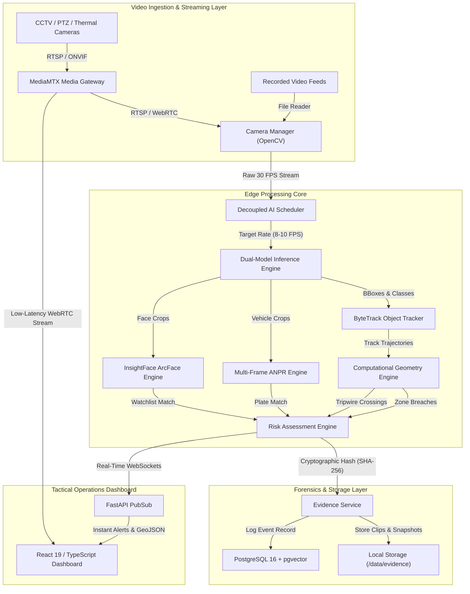

# IBVAP — System Architecture & Technical Specifications

## 1. Architectural Blueprint

The **Intelligent Border Visual Analytics Platform (IBVAP)** is designed around a multi-tier, decoupled edge computing model:

---

## 2. Core Subsystems

### 2.1 Video Ingestion & Frame Decoupling
- **Decoupled Architecture:** Standard video feeds operate at 25–30 FPS. Processing every frame through heavy deep learning models saturates edge compute. IBVAP decouples video display from inference:
  - Video stream maintains full framerate for operator monitoring via WebSockets/WebRTC.
  - A thread-safe circular buffer passes sampled keyframes (8–10 FPS) to the AI Scheduler.

### 2.2 Dual-Model Inference Pipeline
- **Baseline Detector:** YOLOv8/v11 Nano models detect general surveillance classes: `person`, `vehicle`, `animal`.
- **Specialized Threat Detector:** Concurrently evaluates high-risk classes: `drone`, `weapon`, `contraband`.
- **Ensemble Fusion:** Non-Maximum Suppression (NMS) and IoU overlap filtering merge bounding boxes across both models into a unified object list.

### 2.3 Computational Geometry
- **Ray-Casting Point-in-Polygon (PIP):** Determines whether an object's centroid or ground footprint has entered an arbitrary multi-point restricted zone or zero-line buffer.
- **Tripwire Vector Cross-Products:** Tracks consecutive centroid coordinates $(x_{t-1}, y_{t-1}) \to (x_t, y_t)$ across a defined virtual line segment $(A, B)$, discriminating between inward incursions and outward movement.

### 2.4 Multi-Frame ANPR Pipeline
1. Crop vehicle bounding box and isolate license plate region.
2. OCR character recognition via EasyOCR.
3. Clean and normalize string via Indian registration regex patterns (e.g. `^[A-Z]{2}[0-9]{2}[A-Z]{1,2}[0-9]{4}$`).
4. Apply multi-frame consensus voting: a plate is confirmed only after 3 matching detections within a 15-frame window.

### 2.5 Biometric Facial Re-ID & pgvector
- Deep feature extraction via InsightFace (512-dimensional normalized float vectors).
- High-speed nearest neighbor search against suspect database using PostgreSQL `pgvector` with cosine similarity index (`<=>`).

### 2.6 Cryptographic Evidence Integrity
- Every alert triggers the evidence engine to capture a high-resolution snapshot and a 10-second rolling pre/post event video clip.
- Immediate SHA-256 calculation guarantees non-repudiation in legal and military chain-of-custody inquiries.
